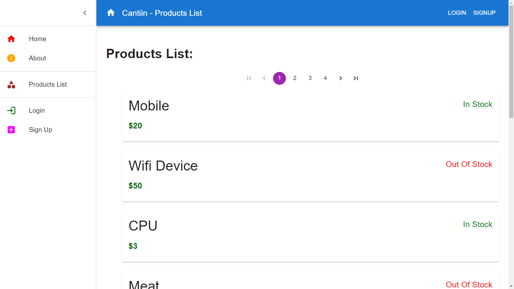
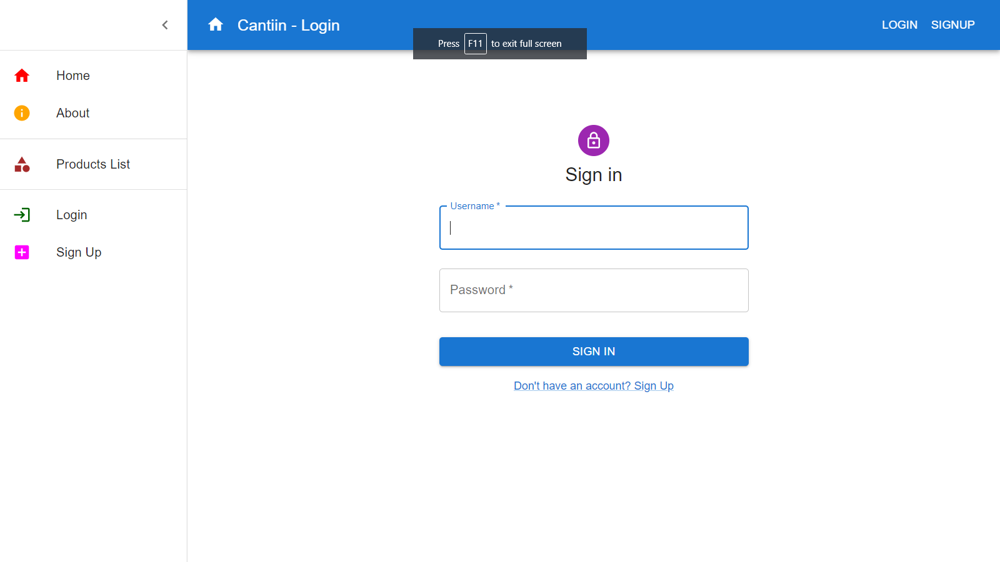
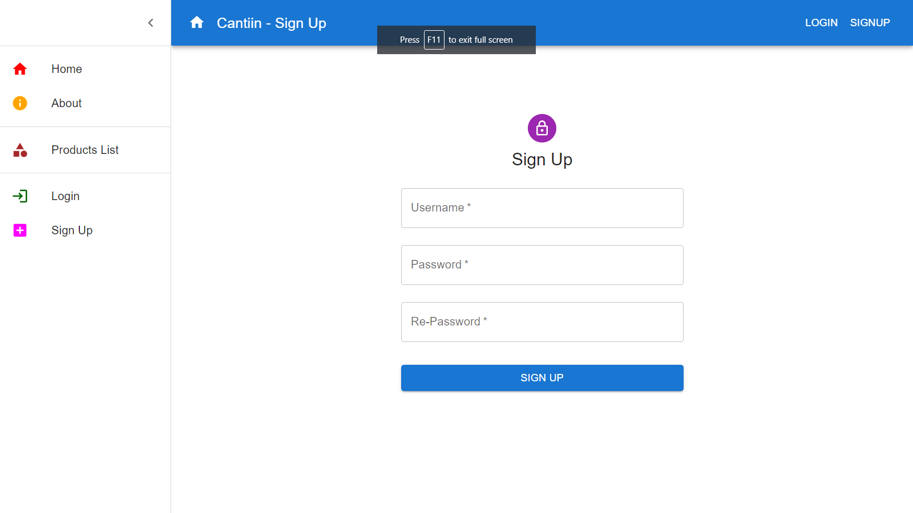
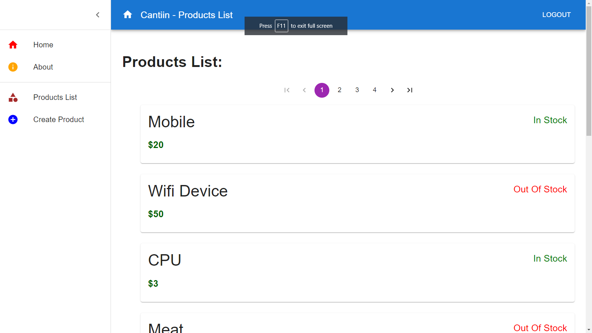

# Cantiin-React-MaterialUI
Creating a react frontend using MaterialUI  for Cantiin.com

# A) Links:

<table>
<tr>
<th>Link Type</th>
<th>Link</th>
</tr>

<tr>
<th>Website (Deployed on AWS)</th>
<td>
<a href="https://cantiin-react.com">
https://cantiin-react.com</a>
</td>
</tr>

<tr>
<th>Youtube</th>
<td>
<a href="https://www.youtube.com/watch?v=tV87kHBrct0">https://www.youtube.com/watch?v=tV87kHBrct0</a>
</td>
</tr>

<tr>
<th>RESTful API backend Link</th>
<td>
<a href="https://cantiin.com/api">https://cantiin.com/api</a>
</td>
</tr>

<tr>
<th>Github Repository</th>
<td>
<a href="https://github.com/OmarThinks/Cantiin-React-MaterialUI">https://github.com/OmarThinks/Cantiin-React-MaterialUI</a>
</td>
</tr>

</table>

# B) Used Technologies:

1. React
2. Material UI
3. React Router Dom

# C) Images:

## C-1) Home Page:

## C-2) Login Page:

## C-3) Signup Page:

## C-4) After Sign up:

