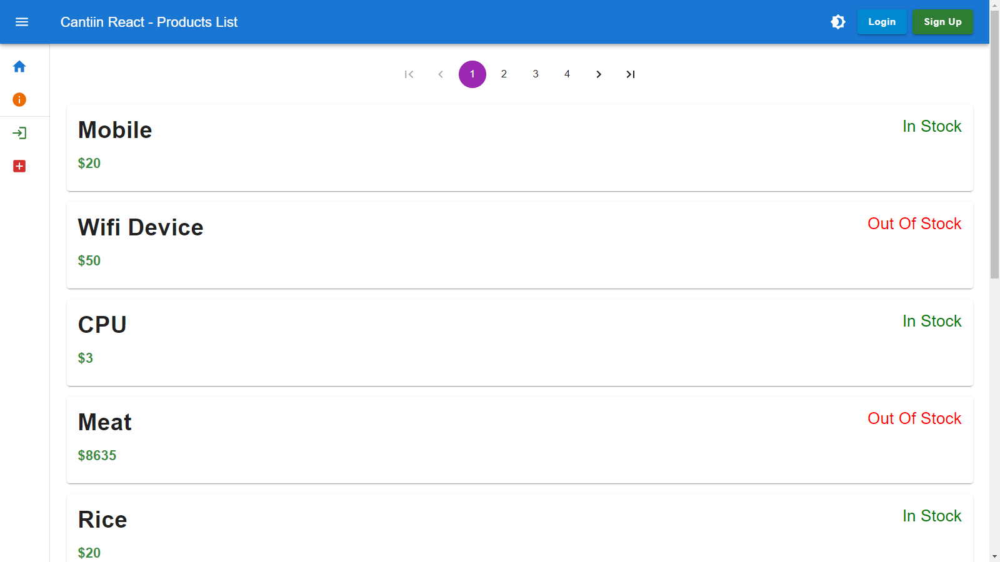
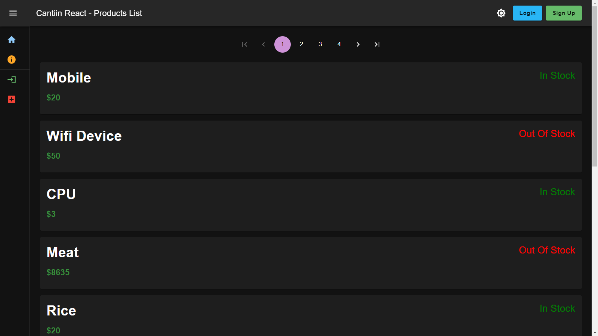

# Cantiin-React-MaterialUI

Creating a react frontend using MaterialUI for Cantiin.com

# A) Links:

<table>
<tr>
<th>Link Type</th>
<th>Link</th>
</tr>

<tr>
<th>Website (Deployed on AWS Amplify)</th>
<td>

https://cantiin-react.com</a> (The website is down dew to the Egyptian Currency Crisis)
</td>
</tr>

<tr>
<th>Youtube</th>
<td>
<a href="https://www.youtube.com/watch?v=sBj2vWlMLfc">https://www.youtube.com/watch?v=sBj2vWlMLfc</a>
</td>
</tr>

<tr>
<th>RESTful API backend Link</th>
<td>
<a href="https://cantiin.com/api">https://cantiin.com/api</a>
</td>
</tr>

<tr>
<th>Github Repository</th>
<td>
<a href="https://github.com/OmarThinks/Cantiin-React-NextJS">https://github.com/OmarThinks/Cantiin-React-NextJS</a>
</td>
</tr>

<tr>
<th>Related Projects</th>
<td>
<a href="https://github.com/OmarThinks/cantiin_django">Cantiin Django</a> 
<a href="https://github.com/OmarThinks/Cantiin-React-Native">Cantiin React Native</a>
</td>
</tr>

</table>

# B) Used Technologies:

1. React
2. Material UI
3. Formik & Yup
4. NextJS
5. AWS Amplify (Frontend Only)

# C) Images:

## C-1) Home Page:

## C-2) Dark Theme:

## C-3) Side Drawer:

## C-4) Signup Page:

## C-5) Login Page:

## C-6) Form Validation:

## C-7) After Logging in:

